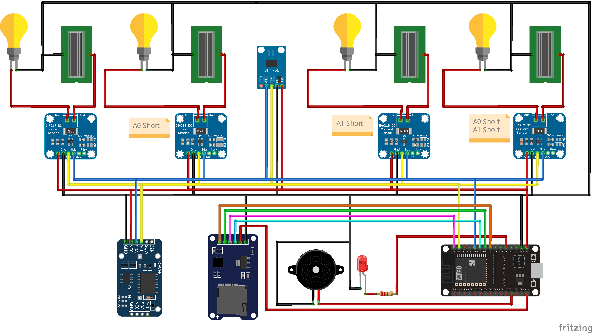

# Optimum-Angle-Solar-Panel-Data-Logger

Project ini untuk membaca nilai tegangan, arus, dan intensitas matahari yang di hasil kan dari ke empat panel surya  dengan sudut masing-masing yang berbeda dengan interval pembacaan nilai setiap 10 menit sekali dari pagi hingga sore hari yang di simpan di micro SD card

*This project is to read the values of voltage, current and solar intensity that are generated from the four solar panels at different angles with a value reading interval of once every 10 minutes from morning to evening which is stored on a micro SD card.*


## Berikut ini Perangkat yang diperlukan <br> *The following devices are required:*
  * ESP 32 DevKit V1 DOIT
  * Sensor INA 219 
  * Sensor Lux BH1750
  * Led
  * Ressitor 1 K ohm
  * Buzzer
  * Module RTC DS3231
  * Module Micro SD CARD Reader Writer
  * Micro SD CARD
  * Solar Panels
  * 12 V Light Fitting (As load voltage depending on the type of solar panel capacity you have)

## Berikut ini Library yang digunakan <br> *The following libraries are used:*
  * RTClib
  * BH1750
  * Adafruit INA219

## Skematik Pengkabelan <br> *Wiring Schematic*



__INA 219__, __Lux BH1750__, __RTC DS3231__| __ESP 32__
-------     | -------
Vcc         | 3.3 V
GND         | GND
SCL         | GPIO 22
SDA         | GPIO 21

__Micro SD CARD Reader Writer__| __ESP 32__
-------     | -------
Vcc         | 5 V
GND         | GND
MOSI        | GPIO 23
MISO        | GPIO 19
SCK         | GPIO 18
CS          | GPIO 5

____        | __ESP 32__
-------     | -------
Buzzer      | GPIO 12
LED         | GPIO 4

## Deskripsi untuk Langkah Pengkodingan <br> *Description for Coding Steps*
 ### Set Time RTC dan Upload Main Kode
   * Pertama lakukan pengkabelan __ESP 32__ dengan __RTC DS3231__ dan silahkan uploading kode __Set-Time-RTC.ino__ untuk melakukan setting waktu
   * Kedua Lanjutkan pengkabelan hingga selesai sesuai skematik dan lakukan uploading kode utama <br>
     Note!!! (saat melakukan uploading sebaiknya lepaskan dahulu module RTC DS3231 dari pengkabelan
     karena program yang tertanam sebelumnya di ESP32 yaitu masih program Set-Time-RTC.ino, di khawatirkan jika module masih terpasang akan mengacaukan waktu yang sudah di setting).
   * Namun jika Anda memiliki dua ESP32 maka anda dapat melakukan pengkoding Set-Time-RTC.ino dan kode utama di ESP32 yang berbeda anda dapat langsung melakukan uploading kode utama

 ### *Set RTC Time and Upload Main Code*
   * First, do the __ESP 32__ wiring with the __RTC DS3231__ and please upload the __Set-Time-RTC.ino__ code to set the time
   * Second, continue wiring until completed according to the schematic and upload the main code <br>
     Note!!! (When uploading, you should first remove the DS3231 RTC module from the wiring because the program previously embedded in the ESP32 is still the Set-Time-RTC.ino program,        it is feared that if the module is still installed it will messing up the time that has been set).
   * However, if you have two ESP32 then you can code Set-Time-RTC.ino and the main code on a different ESP32, you can directly upload the main code


  
 ### Alamat INA219
   INA219 menggunakan komunikasi I2C pada project ini menggunakan 4 module sehingga cara untuk mengubah setiap alamat yaitu dengan melakukan penyolderan pada module. 
   untuk mengetahui alamat model dapat dilihat pada kode utama yaitu:
   ```
   //INA219-----------------
   Adafruit_INA219 INA219_1 (0x40); // -
   Adafruit_INA219 INA219_2 (0x41); // A0 short
   Adafruit_INA219 INA219_3 (0x44); // A1 short
   Adafruit_INA219 INA219_4 (0x45); // A0 dan A1 short
   ```
   jadi  0x40 itu adalah alamat bawaan module<br>
   0x41 untuk alamat jika A0 di Short (Soldering pada A0)<br>
   0x44 untuk alamat jika A1 di Short (Soldering pada A1)<br>
   0x45 untuk alamat jika A0 di Short dan A1 di Short (Soldering pada A0 dan Soldering pada A1)<br>

 ### *Address INA219*
   The INA219 module uses I2C communication, this project uses 4 modules so the way to change each address is by soldering the module. 
   To find out the model address, see the main code, namely:
   ```
   //INA219-----------------
   Adafruit_INA219 INA219_1 (0x40); // -
   Adafruit_INA219 INA219_2 (0x41); // A0 short
   Adafruit_INA219 INA219_3 (0x44); // A1 short
   Adafruit_INA219 INA219_4 (0x45); // A0 dan A1 short
   ```
   so 0x40 is the default address of the module<br>
   0x41 for address if A0 is Short (Soldering on A0)<br>
   0x44 for address if A1 is Shorted (Soldering on A1)<br>
   0x45 for address if A0 is Short and A1 is Short (Soldering on A0 and Soldering on A1)<br>
  

## Cara Kerja Perangkat  <br> *How the Device Works*
 

Terdapat 4 Panel Surya sudah di atur dengan sudut yang berbeda-beda (nilai sudut di sini kebebasan kalian sesuai project yang akan kalian lakukan). Masing-Masing Panel terdapat Beban sebuah lampu, fungsi beban ini berguna untuk menentukan nilai Daya yang di hasilkan oleh Panel Surya. Terdapat 4 Sensor INA219 yang akan membaca nilai Tegangan dan Arus untuk setiap Panel Surya. Lux BH1750 akan membaca Intenstas cahaya matahari. <br>

RTC DS3231 akan memberikan informasi waktu ke Microkontroller. Informasi waktu tersebut akan diproses untuk waktu pennyimpanan data. Data di atur dari jam 8.00 sampai jam 17.00 dengan interval setiap 10 menit sekali.<br>

Ketika waktu telah terpenuhi maka Buzzer akan bernyanyi untuk mengindikasikan sedang terjadi proses penyimpanan. Data ke empat Panel surya dan Lux Sensor akan di simpan ke micro SD card melalui modul Micro SD CARD Reader Writer, jika data berhasil tersimpan buzzer mati, mengindikasikan proses pengiriman data telah selesai.<br>

fungsi led sebagian sistem pemberi peringatan jika terjadi anomali dari Sensor-sensor, Modul RTC DS3231 atau  Micro SD CARD Reader Writer. Led jika ON maka mengindikasikan terjadi sebuah Anomali.<br>

<br><br>
*There are 4 solar panels that have been arranged at different angles (the angle value here is your freedom according to the project you are going to do). Each panel has the load of a lamp, this load function is useful for determining the power value produced by the solar panel. There are four INA219 sensors that will read the voltage and current values for each solar panel. Lux BH1750 will read the intensity of sunlight.* <br>

*RTC DS3231 will provide time information to the Microcontroller. This time information will be processed for data storage time. Data is set from 8.00 to 17.00 with an interval of every 10 minutes.* <br>

*When the time has been fulfilled, the Buzzer will sing to indicate the storage process is taking place. Data on the four solar panels and the Lux Sensor will be saved to the micro SD card via the Micro SD CARD Reader Writer module. If the data is successfully saved the buzzer goes off, indicating the data sending process has been completed.* <br>

*The LED function is part of the warning system if an anomaly occurs from the sensors, DS3231 RTC Module or Micro SD CARD Reader Writer. If the LED is ON, it indicates an anomaly has occurred.* <br>


